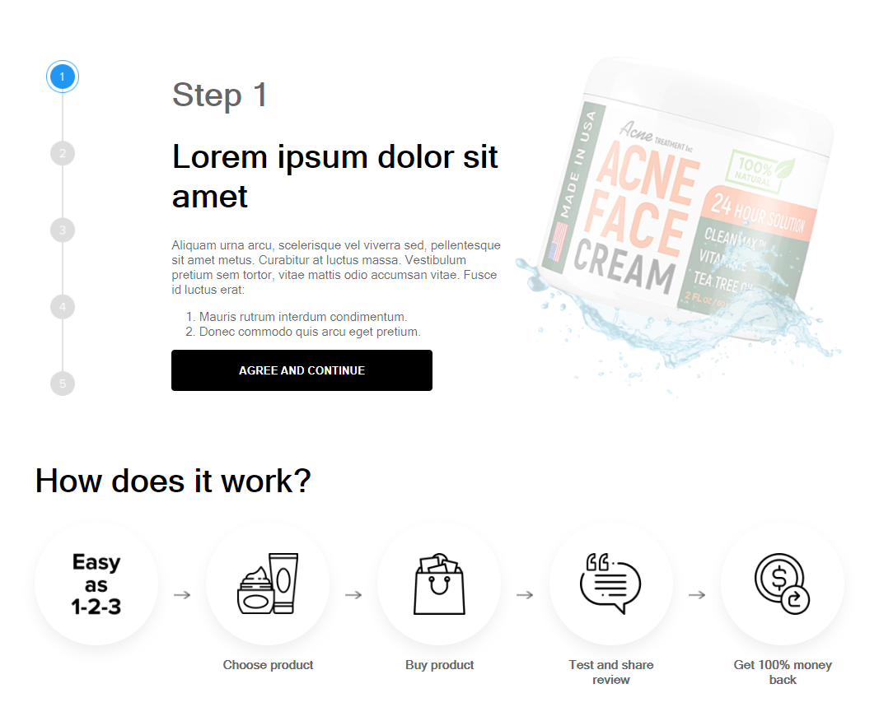
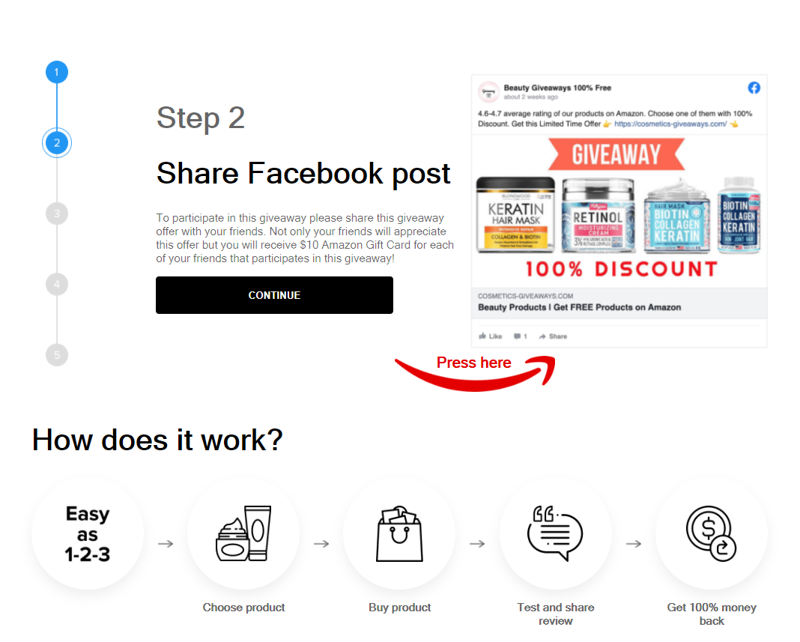

# Тестовое задание

Сайт с поддержкой экранов шириной 1280px и 320px

## Поддерживаемые форматы

Внешний вид страницы изменяется в зависимости от ширины браузера

")

")

## Переключение по этапам

При нажатии на этап в панели этапов снизу будет осуществлен переход на одну из страниц

